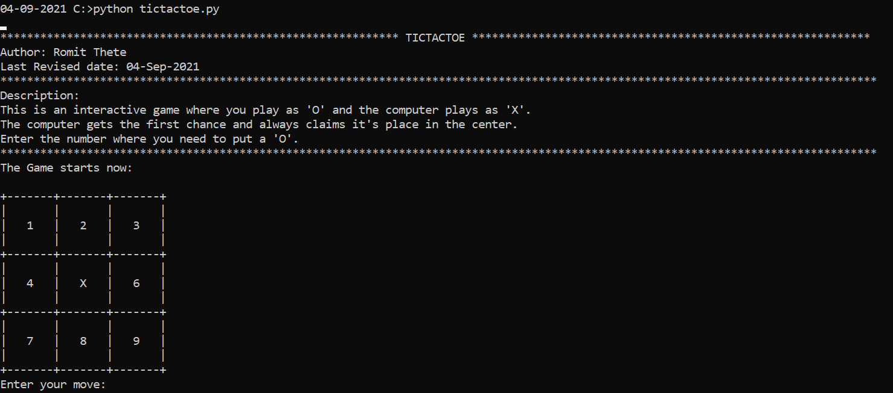
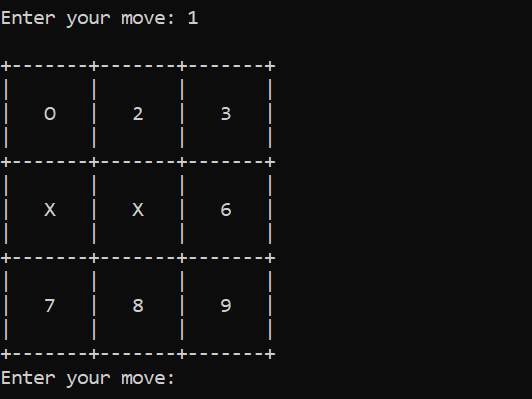
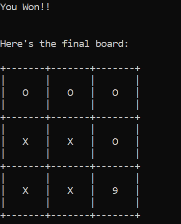
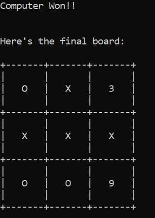
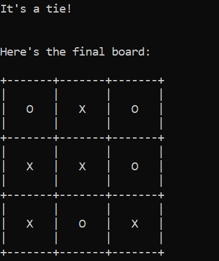
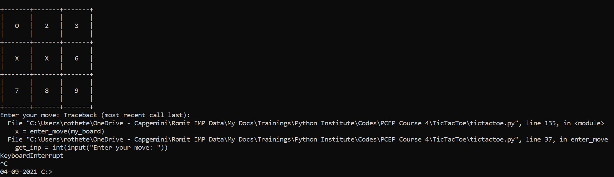

# Tic Tac Toe : The Game!
Presenting, the world-famous Tic Tac Toe!<br>
An addictive game for all age groups.<br>
This is a complete end-to-end game.

##How to Run:
1. Windows:
```
python tictactoe.py
```

2. Unix/Mac:
```
python3 tictactoe.py
```

## How to play:
The computer plays 'X' whereas the player plays 'O'.
1. The computer always plays it's first move by dropping an 'X' at the center. <br><br>

2. The player needs to enter the number where he/she wishes to drop an 'O'.
3. The computer plays its next move by dropping 'X' at a random position.
4. User gets a chance again and the cycle continues.
<br><br>

5. A win is triggered if rows or columns or diagonals have the same value: 'X' or 'O'. If nobody wins, the game prompts a tie.
<br><br>
&nbsp;&nbsp;&nbsp;&nbsp;&nbsp;&nbsp;
6. To exit in the middle, type ```Ctrl+C```(hit enter after the same if it doesn't work).
<br><br>


<br><br>
<p align="center">
    Developed with :heart: in Python by Romit Thete
</p>

